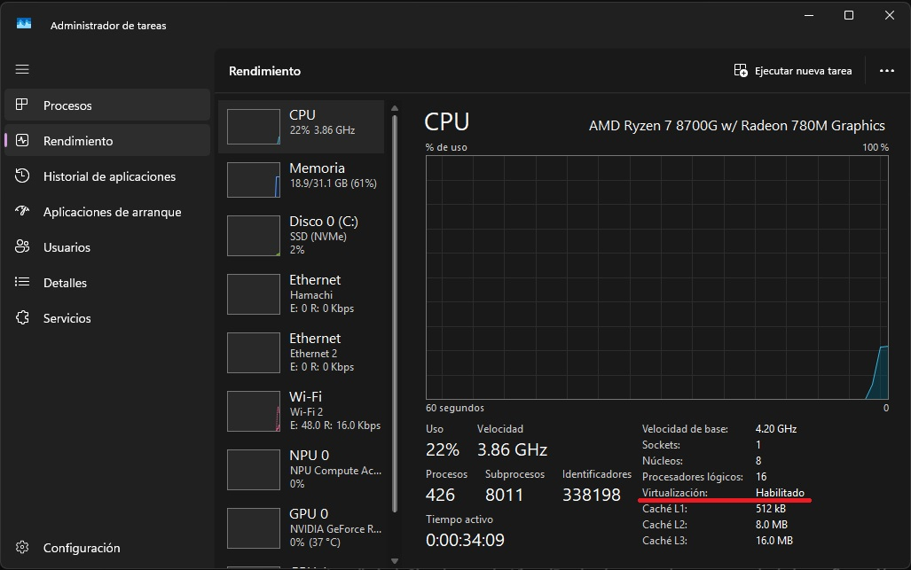
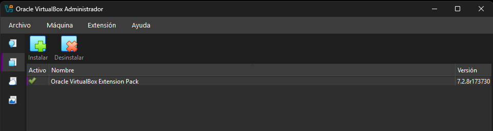
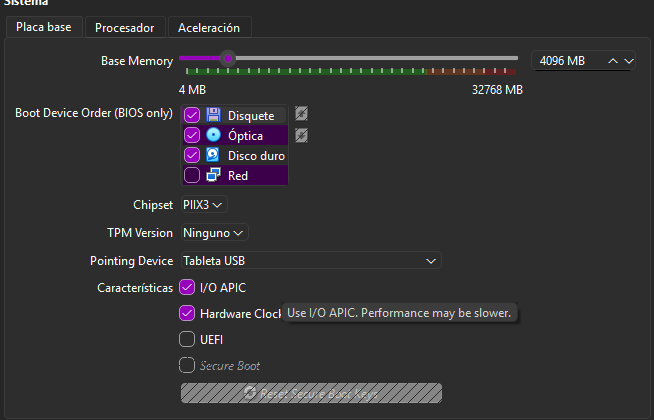
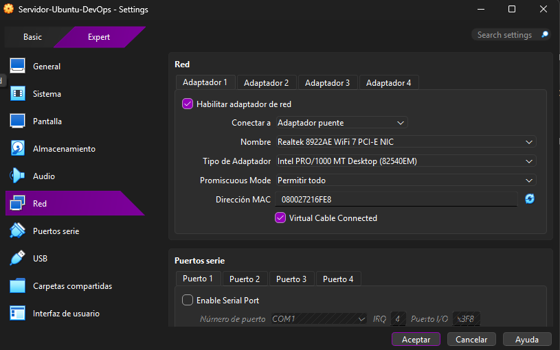
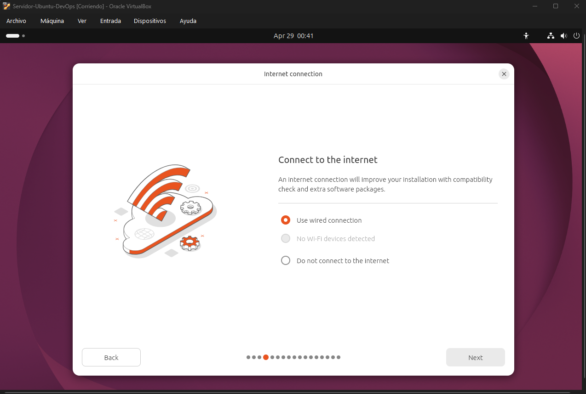
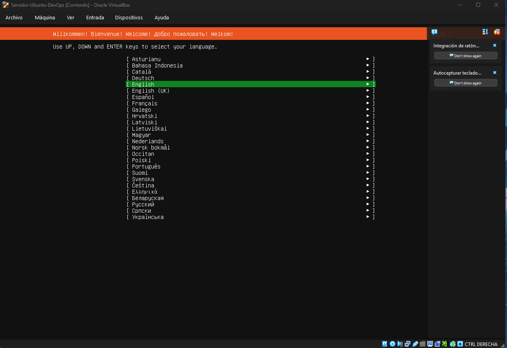
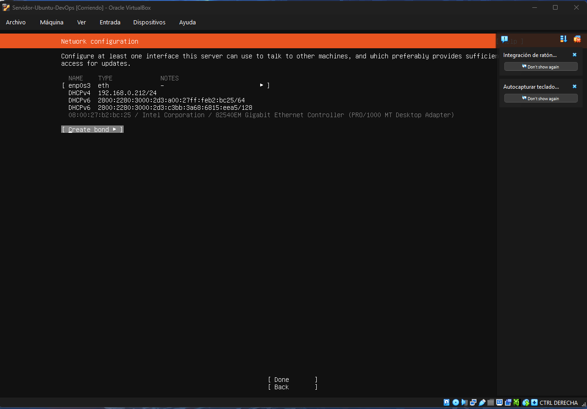
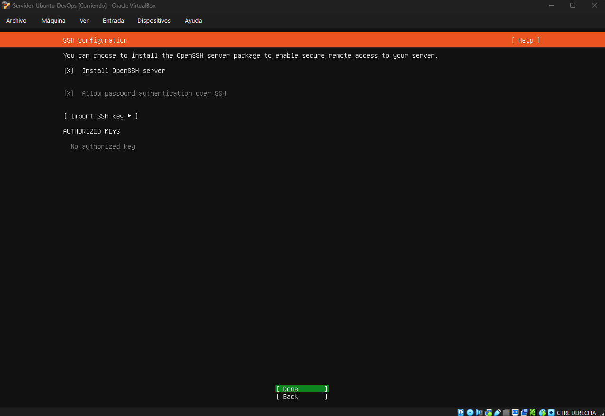

# DevOps-Proyecto1
Repositorio de primer proyecto como Dev Ops
# DevOps Trainee - Introducción

Este repositorio contiene el progreso y la documentación técnica de mis proyectos en el camino hacia DevOps. El enfoque principal es el aprendizaje práctico, documentando cada paso desde la infraestructura base hasta la automatización y seguridad.

---

## Especificaciones del Host (Hardware)
Para garantizar el rendimiento óptimo de las máquinas virtuales y evitar latencias en la emulación, se utiliza hardware con soporte nativo para virtualización:

* **CPU:** AMD Ryzen 7 8700G (8C/16T, 5.1GHz)
* **GPU:** NVIDIA GeForce RTX 4060 Ti 8GB GDDR6 (ASUS Dual EVO OC)
* **RAM:** 32GB Team T-Force Vulcan Black DDR5 5600MHz (AMD EXPO)
* **Placa Base:** Aorus (Gigabyte) AM5 X670-P
* **S.O.:** Windows 11

---


### Fase 0: Preparación del Entorno y BIOS
Se habilitó el soporte de virtualización por hardware (**SVM Mode**) en la BIOS de la placa Aorus para permitir que el hipervisor (VirtualBox) acceda directamente a las capacidades del procesador AMD Ryzen.

**Validación en Windows:**
Se verificó en el Administrador de Tareas que la virtualización está activa.



### Fase 1: Instalación de Herramientas de Virtualización
Se instaló **Oracle VirtualBox 7.x** junto con su **Extension Pack**. Este complemento es vital para la gestión de controladores de red avanzados e integración de dispositivos.



### Fase 2: Creación y Configuración de la VM
Se configuró una instancia de **Ubuntu Server 24.04 LTS** con los siguientes recursos:
* **vCPU:** 4 núcleos
* **RAM:** 4 GB DDR5
* **Disco:** 30 GB (VDI Dinámico)
* **Red:** Configurada en modo **Adaptador Puente (Bridged)** para que el servidor obtenga su propia IP dentro de la red local Wi-Fi.



### Configuración de Red
Se configuró un **Adaptador Puente** para que el servidor tenga una IP propia en la red local, permitiendo el acceso via SSH.


### Nota Técnica: Migración de Desktop a Server
Durante la configuración inicial, se evaluó el uso de Ubuntu Desktop. Sin embargo, para alinearse con los estándares profesionales de **DevOps** (donde la eficiencia de recursos y el manejo vía CLI son primordiales), se decidió migrar a **Ubuntu Server 24.04 LTS**.

| Versión Desktop (Descartada) | Versión Server (Seleccionada) |
|  |  |

### Fase 3: Instalación del S.O. y Networking
Durante la instalación, se validó que la VM recibiera una IP válida del router mediante DHCP, permitiendo la comunicación bidireccional entre el Host (Windows) y el Guest (Linux).



**Configuración de Acceso Remoto:**
Se instaló **OpenSSH Server** para habilitar la administración remota vía terminal.



---

## 📂 Estructura del Repositorio
```text
.
├── README.md
└── img/
    ├── bios_check.png      # Administrador de Tareas (CPU > Virtualización)
    ├── extension_pack.png   # VirtualBox > Preferencias > Extensiones
    ├── setup_vm_1.png      # Creación de la VM en VirtualBox
    ├── network_config.png   # IP asignada en la instalación de Ubuntu
    └── ssh_setup.png        # Paso de OpenSSH marcado con [X]